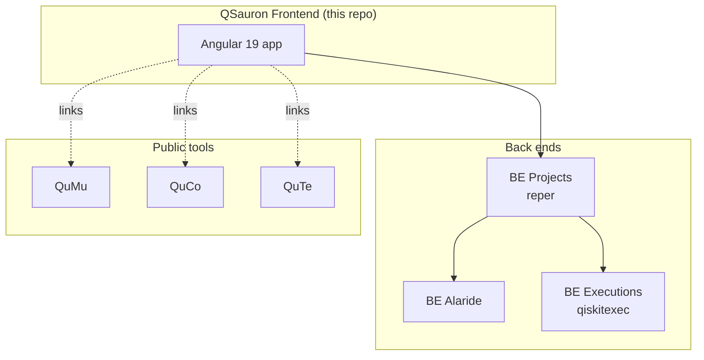
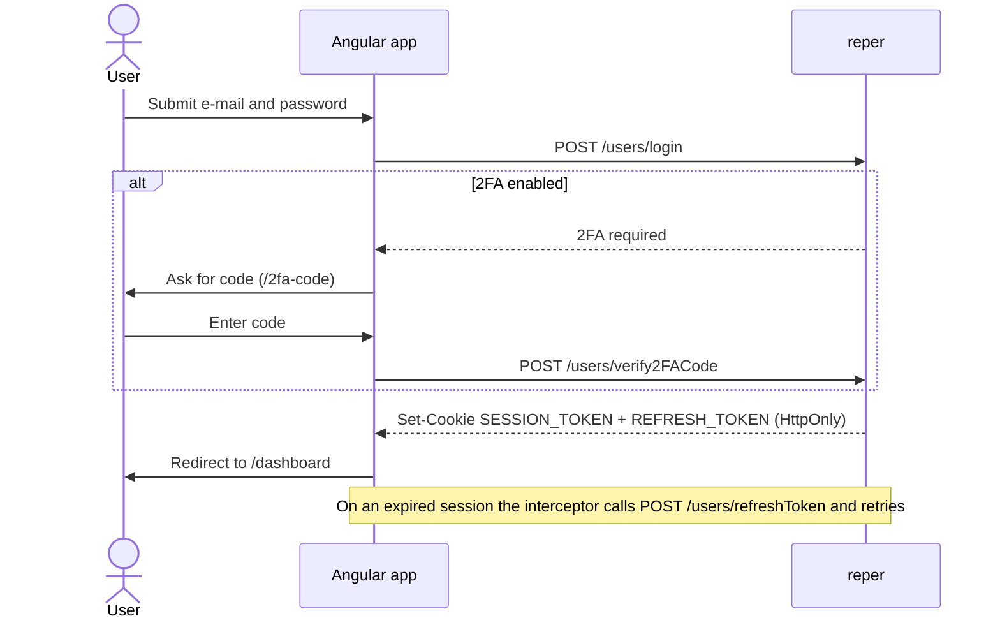
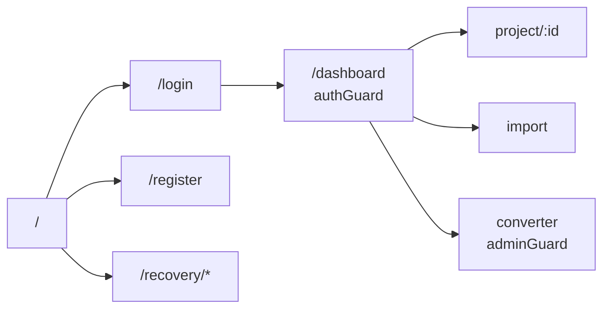

# Architecture

## System context

```mermaid
flowchart TB
    subgraph FE["QSauron Frontend (this repo)"]
        APP["Angular 19 app"]
    end
    subgraph BE["Back ends"]
        PROJ["BE Projects<br/>reper"]
        ALA["BE Alaride"]
        EXE["BE Executions<br/>qiskitexec"]
    end
    subgraph TOOLS["Public tools"]
        QUMU["QuMu"]
        QUCO["QuCo"]
        QUTE["QuTe"]
    end
    APP --> PROJ
    PROJ --> ALA
    PROJ --> EXE
    APP -. links .-> QUMU
    APP -. links .-> QUCO
    APP -. links .-> QUTE
```

## Login with optional 2FA

```mermaid
sequenceDiagram
    actor U as User
    participant F as Angular app
    participant R as reper
    U->>F: Submit e-mail and password
    F->>R: POST /users/login
    alt 2FA enabled
        R-->>F: 2FA required
        F->>U: Ask for code (/2fa-code)
        U->>F: Enter code
        F->>R: POST /users/verify2FACode
    end
    R-->>F: Set-Cookie SESSION_TOKEN + REFRESH_TOKEN (HttpOnly)
    F->>U: Redirect to /dashboard
    Note over F,R: On an expired session the interceptor calls POST /users/refreshToken and retries
```

## Routes and guards

```mermaid
flowchart LR
    ROOT["/"] --> LOGIN["/login"]
    ROOT --> REG["/register"]
    ROOT --> REC["/recovery/*"]
    LOGIN --> DASH["/dashboard<br/>authGuard"]
    DASH --> PD["project/:id"]
    DASH --> IMP["import"]
    DASH --> CONV["converter<br/>adminGuard"]
```
